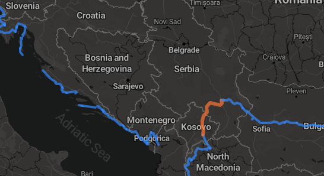

# Ezio

Display a recorded route as a static website. Take a look at my
[Balkans cycling route](https://projects.pascalsommer.ch/balkanvelo/) to see an 
example output.

## Usage

TODO

## Limitations

This program currently assumes that the following constraints hold. The output
is undefined if the data does not follow these constraints.

* Every single route recording must not extend across midnight in the active timezone.
* Every day with a route recording must have at least one photo taken on that day.
* The combined route must not cross the ±180° longitude line.
* The combined route must not cross a timezone boundary.
* The viewer currently highlights route segments by day. No other grouping type
  (weeks / custom / etc.) is currently possible.

Some of these constraints might be relaxed in the future if the need arises.

## License

AGPL-3.0-or-later
